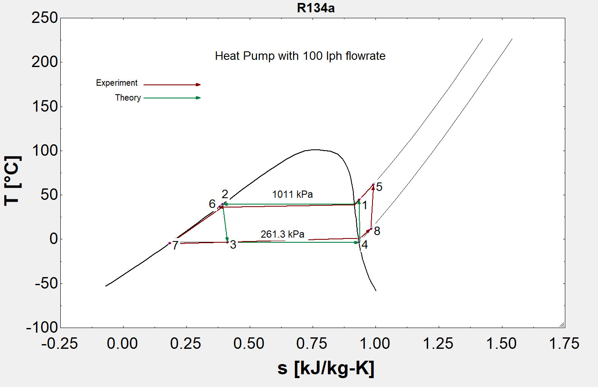

# Heat Pump Cycle Analysis (R134a)

An EES (Engineering Equation Solver) model of a vapor-compression heat
pump cycle, comparing idealized theoretical performance against
experimental measurements at a flow rate of 100 L/h.

## Overview

The script evaluates all four state points of the vapor-compression
cycle (compressor discharge, condenser outlet, after the expansion
valve, and evaporator outlet) for two separate cases:

1. **Theoretical cycle** — assumes an ideal cycle: saturated liquid at
   condenser exit (`x=0`), saturated vapor at evaporator exit (`x=1`),
   and isentropic compression (`s1 = s4`).
2. **Experimental cycle** — uses directly measured temperatures at each
   of the four state points, with no idealizing assumptions.

Both cases compute the heat rejected at the condenser (`Q_H`), heat
absorbed at the evaporator (`Q_L`), compressor work input (`W_in`), and
the resulting coefficient of performance (`COP_HP`).

## Cycle State Points

| Point | Location | Theoretical basis | Experimental basis |
|-------|----------|-------------------|---------------------|
| 1 | Compressor discharge | Isentropic (s1 = s4), P1 | Measured T |
| 2 | Condenser outlet | Saturated liquid (x=0), P1 | Measured T |
| 3 | After expansion valve | h3 = h2 (throttling), P2 | Measured T |
| 4 | Evaporator outlet | Saturated vapor (x=1), P2 | Measured T |

## Key Equations

- Condenser heat rejection: `Q_H = h1 - h2`
- Evaporator heat absorption: `Q_L = h4 - h3`
- Compressor work input: `W_in = h1 - h4`
- Coefficient of performance: `COP_HP = Q_H / W_in`

## Operating Conditions

- Refrigerant: R134a
- Flow rate: 100 L/h
- High-side pressure: 1011.3 kPa
- Low-side pressure: 261.3 kPa

## Results

## T-S Diagram
The T-S diagram shows diffrence between experimental and theoriical cycle

## Requirements

- EES (Engineering Equation Solver) with the built-in R134a property
  database

## Usage

Open the `.EES` file in EES and click **Solve**. The property tables
(`h`, `T`, `s` for each state point) and the derived `Q_H`, `Q_L`,
`W_in`, and `COP_HP` values for both the theoretical and experimental
cases will populate automatically.

## Author

Aliakbar Hoveydapour

## License

MIT
